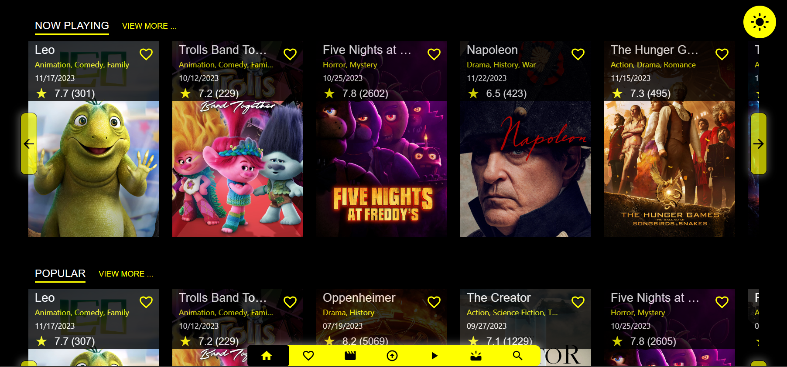

# Movie Database
### 

A simple movie database application built using Typescript, React and Redux.

## Features

- Search for movies by title, genre, or actor.
- View movie details, including cast, release date, and ratings.
- Add movies to your watchlist.


## Installation

Install the dependencies and devDependencies and start the server.

```sh
npm install
npm start
```
Runs the app in the development mode.\
Open [http://localhost:5173](http://localhost:5173) to view it in the browser.

## Screenshot




